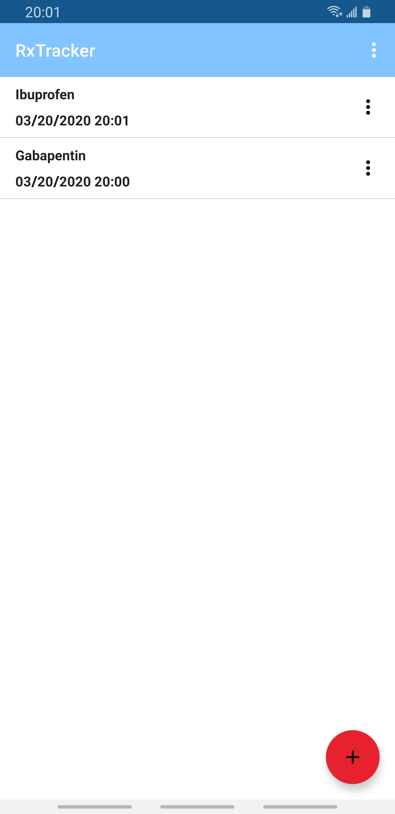
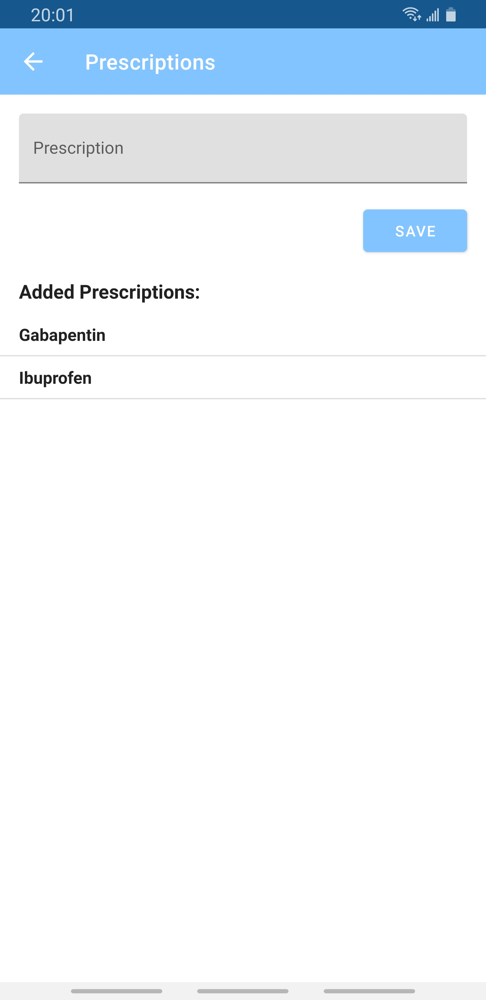
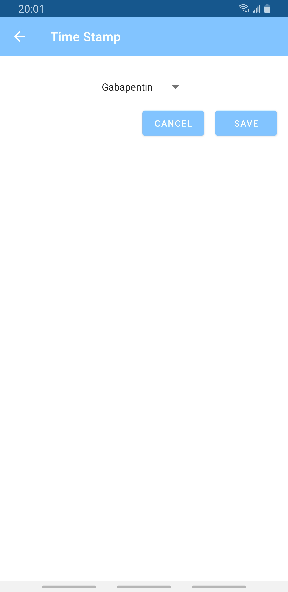
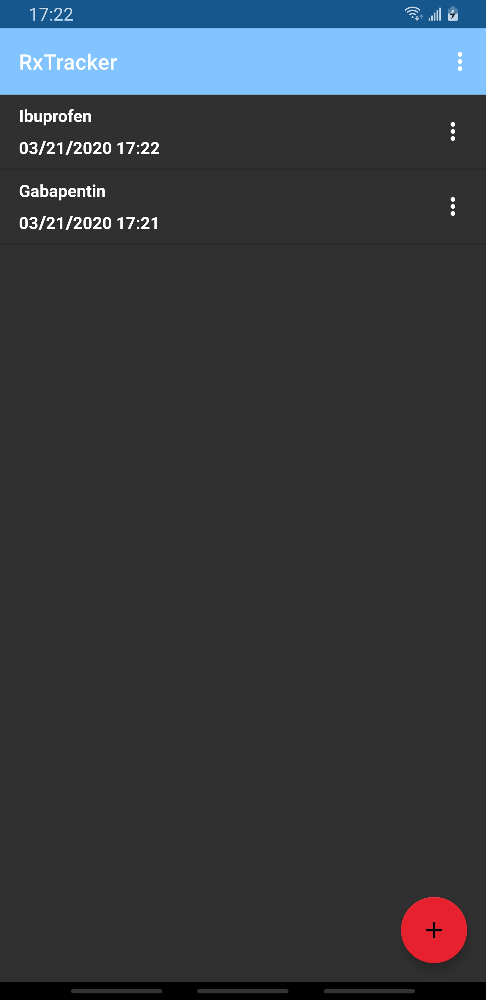

# RxTracker

This helps you keep track of when you take prescriptions.

An APK is [available](https://github.com/DavidPrecopia/RxTracker/releases/download/v1.5/rxtracker-v1.5.apk).

**Technical Features**

- MVVM architecture with multithreading via RxJava 3 and dependency injection via Dagger 2.
  - View: Fragments set-up as Passive Views. I use a single Activity with Jetpack's [Navigation](https://developer.android.com/guide/navigation).
  - ViewModel: A combination of a ViewModel and a Presenter. It is extending Jetpack's [ViewModel](https://developer.android.com/topic/libraries/architecture/viewmodel)
  - Repository: It hides the implementation details from the front-end. There are separate repositories for storage of the time stamps and prescriptions.
- Multi-module
  - App module
    - Front-end.
    - ViewModels and their respective Views.
    - Dagger 2.
  - Domain module
    - Contains the app's solution its problem domain.
    - The Interface that the repository will implement and the front-end will use to talk to the repository. Only RxJava observables are returned, Flowables and Completables specifically.
    - Data models for the View.
  - Data module
    - Implementation specific details for how data is stored and handled.
    - Repositories for data storage.
    - Data models for the back-end.
- The database is SQLite implemented with Jetpack's [Room](https://developer.android.com/topic/libraries/architecture/room).
- [Firebase Crashlytics](https://firebase.google.com/docs/crashlytics/) for automated crash reporting.
- Unit testing with JUnit 5, AssertJ, and MockK.
- CI with GitHub Actions.

## Screenshots

View all added time stamps.

Add prescriptions and view what has already been added.

Add a new time stamp.

Night mode

## License

    Copyright (c) 2020-present, David M Precopia.

    Licensed under the Apache License, Version 2.0 (the "License");
    you may not use this file except in compliance with the License.
    You may obtain a copy of the License at

    http://www.apache.org/licenses/LICENSE-2.0

    Unless required by applicable law or agreed to in writing, software
    distributed under the License is distributed on an "AS IS" BASIS,
    WITHOUT WARRANTIES OR CONDITIONS OF ANY KIND, either express or implied.
    See the License for the specific language governing permissions and
    limitations under the License.
